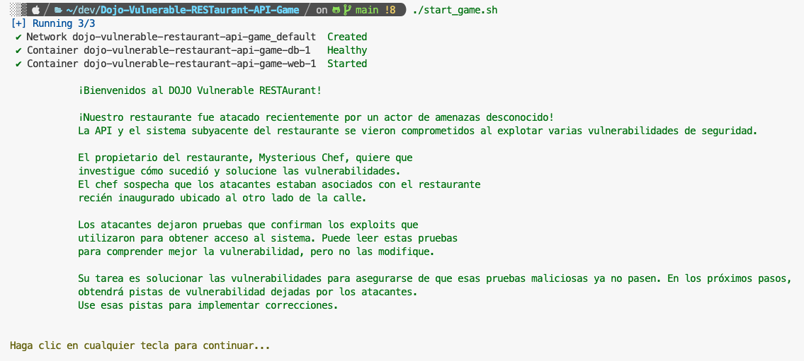

# 🏆 Dojo Api Sec 🏆: ¡Dominando la seguridad de API! 🚀

¡Únete a nuestro Dojo Api Sec para mejorar tus habilidades en seguridad de desarrollo de API! Aprenderás sobre vulnerabilidades y pondrás en práctica la mitigación de las mismas en un juego interactivo que incluye 5 de las principales amenazas de API según el OWASP Top 10. Comenzamos con una introducción a los riesgos y luego te sumergirás en la práctica para fortalecer tus conocimientos y proteger tus proyectos. ¡Únete ahora y mejora tus habilidades en seguridad de API! 👨‍💻🔒💻🎮 #ApiSecurity #OWASP #AprendeHaciendo

Un servicio API intencionalmente vulnerable diseñado para fines de aprendizaje y capacitación dedicado a desarrolladores, hackers éticos e ingenieros de seguridad. La idea del proyecto es proporcionar un entorno que pueda ampliarse fácilmente con nuevos puntos finales vulnerables y mecanismos que puedan usarse en capacitaciones para detectar y explotar vulnerabilidades identificadas.

It's a training playground: 

* **For Developers** - engage in a dedicated game where you will identify and fix vulnerabilities interactively. 
* **For Ethical Hackers** - exploit vulnerabilities manually or use automated tools. Treat it as a CTF challenge, you can start from low privileged API user and escalate to root user. There is one path to achieve this. API docs are provided to facilitate your hacking adventure.
* **For Security Engineers** - utilise various security automation tools such as SAST, DAST, IaC, etc., to test vulnerability detection mechanisms.

Es un campo de entrenamiento: 

* **Para desarrolladores**: participa en un juego dedicado en el que identificarás y solucionarás vulnerabilidades de forma interactiva. 
* **Para hackers éticos**: explota vulnerabilidades de forma manual o utiliza herramientas automatizadas. Trátalo como un desafío CTF, puedes comenzar como usuario de API con pocos privilegios y escalar hasta el usuario root. Hay un camino para lograrlo. Se proporcionan documentos de API para facilitar tu aventura de piratería. 
* **Para ingenieros de seguridad**: utiliza varias herramientas de automatización de seguridad como SAST, DAST, IaC, etc., para probar mecanismos de detección de vulnerabilidades.

## 👨‍💻 Developers Approach

Para los desarrolladores, se creo un juego dedicado donde pueden identificar y corregir vulnerabilidades en aplicaciones basadas en FastAPI de forma interactiva.

1. Install [Docker](https://www.docker.com/get-started/) and [Docker Compose V2](https://docs.docker.com/compose/install/).

2. Inicia el juego ejecutando los siguientes comandos:
```sh
git clone https://github.com/asavior2/Dojo-Vulnerable-RESTaurant-API-Game.git
cd Dojo-Vulnerable-RESTaurant-API-Game
./start_game.sh
```
3. Deberías observar la siguiente pantalla o parecida xD:


4. Puede implementar las correcciones sin necesidad de reiniciar la instancia de Docker. Dado que no se requieren cambios en los modelos, no debería ser necesario reiniciar las migraciones.

En este punto, la aplicación se ejecuta localmente. Puedes consultar el **paso 3** en la siguiente sección para obtener más detalles sobre cómo acceder a la API y la documentación.

## 👾 Ethical Hackers Approach

Puedes abrir un RESTAurante fácilmente con sólo unos pocos pasos, no necesitas tener un gran presupuesto, local alquilado, cocineros o camareras...

Solo necesitas encontrar un Chef y seguir los pasos:

1. Install [Docker](https://www.docker.com/get-started/) and [Docker Compose V2](https://docs.docker.com/compose/install/).

2. Implemente RESTAurant localmente con Docker ejecutando los siguientes comandos:

    ```sh
    git clone https://github.com/asavior2/Dojo-Vulnerable-RESTaurant-API-Game.git
    cd Dojo-Vulnerable-RESTaurant-API-Game
    ./start_app.sh
    ```

3. El servicio API se expondrá en [http://localhost:8001](http://localhost:8001) de forma predeterminada. La documentación de la API se puede encontrar en los siguientes puntos finales:
 * Swagger - [http://localhost:8001/docs](http://localhost:8001/docs)
 * Redoc - [http://localhost:8001/redoc](http://localhost:8001/redoc)

4. Para cerrar el restaurante al final del día de hackeo, simplemente ejecute:
```
./stop_app.sh
```
Los datos persistirán entre paradas y arranques.

¡Ya estás listo para servir los platos ahora, **haz enojar al Chef explotando vulnerabilidades** o **hazlo feliz arreglándolos**!

## 🛠️ Development Stack

Se desarrolló con el marco de trabajo Python FastAPI y utiliza una base de datos PostgreSQL. El entorno está en contenedores y se puede implementar fácilmente de forma local con Docker. Con Python y FastAPI, es bastante sencillo ampliar la aplicación con nuevas características vulnerables en poco tiempo. 

Damn Vulnerable RESTAurant en realidad no está limitado a ningún tipo específico de API, ya que los puntos finales pueden utilizar API REST, GraphQL y otros. Es un restaurante, por lo que se pueden servir varios platos allí a lo largo del tiempo.

## ⚠️ Warning and Disclaimer!

¡El Dojo Damn Vulnerable RESTaurant vulnerable es muy vulnerable! No sirvas platos de este RESTAURANTE en la vía pública... ejem... ¡en redes! 

No lo subas a la carpeta html pública de tu proveedor de alojamiento ni a ningún servidor que dé acceso a Internet, ya que se verán comprometidos.

Se recomienda implementar RESTAURANTE localmente con Docker. El uso de la aplicación RESTAURANTE vulnerable, que es intencionalmente insegura por diseño, es bajo tu propio riesgo. No asumimos ninguna responsabilidad por posibles daños, perjuicios o infracciones de seguridad que puedan surgir del uso de RESTAURANTE. Esta aplicación se creó específicamente con fines educativos y de formación en entornos controlados, como aprender sobre vulnerabilidades y practicar técnicas de piratería ética. Es responsabilidad de RESTAURANTE utilizar RESTAURANTE de forma responsable y exclusiva en entornos a los que tengas derecho a acceder y modificar. Al utilizar RESTAURANTE, reconoces que cualquier uso o consecuencia no intencionada es tu responsabilidad exclusiva, y declinamos toda responsabilidad por dichas acciones.

## 🧾 License

Damn Vulnerable RESTaurant se ha desarrollado con orgullo bajo los términos de la Licencia Pública General GNU versión 3.0 (GNU GPL v3.0). Esta licencia fortalece a la comunidad de código abierto al promover los principios de libertad, colaboración y transparencia del software. Con la GNU GPL v3.0, RESTAurant fomenta el aprendizaje, el intercambio y las contribuciones de hackers éticos, ingenieros de seguridad y desarrolladores para mejorar colectivamente sus habilidades y su comprensión de las vulnerabilidades de seguridad. Revise el archivo de LICENCIA para obtener una descripción detallada de los derechos y responsabilidades asociados con el uso y la contribución a este proyecto.
